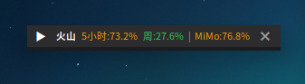
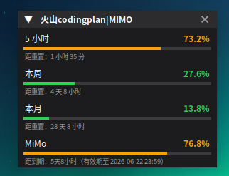

# Coding Plan Monitor

一个 Linux/UOS 桌面悬浮窗，用于监控：

- 火山方舟 Coding Plan：5 小时 / 本周 / 本月用量
- 小米 MiMo Token Plan：套餐总用量

程序只调用平台管理/用量查询接口，不调用模型推理接口，**不会消耗模型 token 或额度**。

## 功能特性

- Tkinter 桌面悬浮窗，置顶、可拖动、可折叠
- 火山方舟三窗口用量进度条：5 小时 / 本周 / 本月
- MiMo Token Plan 总用量进度条
- 折叠态紧凑显示：`火山 5小时:xx% 周:xx% | MiMo:xx%`
- 颜色阈值：<60% 绿色，60%~90% 黄色，≥90% 红色
- 桌面通知：高用量提醒、Cookie 过期提醒
- 自动读取 360 浏览器（UOS 版 / Chromium 系）Cookie
- SQLite 本地历史记录与提醒去重
- 支持 systemd user service 开机自启

## 截图

### 折叠态



### 展开态



## 运行环境

已在以下环境测试：

- UOS Desktop / Linux
- Python 3.11
- Tkinter
- systemd user service
- 360 浏览器 UOS 版（Chromium Cookie 数据库）

依赖：

```bash
python3.11 -m pip install -r requirements.txt
```

`cryptography` 用于解密 Chromium Cookie 数据库中的加密 Cookie。

## 快速开始

```bash
git clone <your-repo-url>
cd coding-plan-monitor
python3.11 -m pip install -r requirements.txt
python3.11 test_api.py
python3.11 main.py
```

默认 `auto` 模式会读取：

```text
~/.config/com.360.browser/Default/Cookies
```

如果你使用其他浏览器，或自动读取失败，请参考 `cookie导出指南.md` 使用手动模式。

## 配置

复制配置模板：

```bash
cp config.example.json config.json
chmod 600 config.json
```

`config.json` 不应提交到 GitHub，已被 `.gitignore` 忽略。

常用配置：

```json
{
  "auth": {
    "mode": "auto",
    "cookie": "",
    "csrf_token": "",
    "mimo_cookie": ""
  },
  "polling": {
    "interval_seconds": 60,
    "timeout_seconds": 10
  },
  "alerts": {
    "session": { "warn": 70, "critical": 90, "emergency": 98 },
    "weekly": { "warn": 80, "critical": 95 },
    "monthly": { "warn": 80, "critical": 95 },
    "mimo": { "warn": 60, "critical": 90 },
    "sound_enabled": true,
    "notify_enabled": true
  }
}
```

## 开机自启

```bash
mkdir -p ~/.config/systemd/user
cp coding-plan-monitor.service.example ~/.config/systemd/user/coding-plan-monitor.service
```

编辑 `~/.config/systemd/user/coding-plan-monitor.service`，把 `ExecStart` 改成你的实际项目路径，例如：

```ini
ExecStart=/usr/bin/env python3.11 /path/to/coding-plan-monitor/main.py
```

启用：

```bash
systemctl --user daemon-reload
systemctl --user enable --now coding-plan-monitor
```

查看状态：

```bash
systemctl --user status coding-plan-monitor
journalctl --user -u coding-plan-monitor -f
```

## 项目结构

```text
coding-plan-monitor/
├── api.py                         # 火山方舟与 MiMo API 封装
├── cookie_loader.py               # Chromium/360 浏览器 Cookie 读取与解密
├── main.py                        # 程序入口与后台轮询线程
├── notifier.py                    # 桌面通知与声音提醒
├── storage.py                     # SQLite 历史记录与提醒去重
├── test_api.py                    # API 连通性测试
├── ui.py                          # Tkinter 悬浮窗 UI
├── config.example.json            # 配置模板
├── coding-plan-monitor.service.example
├── cookie导出指南.md
├── 安装说明.md
├── requirements.txt
└── .gitignore
```

## 隐私与安全

本仓库不应包含以下文件：

- `config.json`
- `usage.db` / `usage.db-shm` / `usage.db-wal`
- `__pycache__/`
- 任何 Cookie、token、API Key、JWT、手机号、账号 ID

程序运行时会从本机浏览器 Cookie 数据库读取登录态，仅在本机向对应平台接口发送请求。请自行确认你对这些平台接口的使用符合相应服务条款。

## 不会消耗模型 token

本程序调用的是：

- 火山方舟控制台用量查询接口
- MiMo Token Plan 用量/套餐详情接口

这些接口等同于在网页控制台查看套餐用量，不是模型推理接口，不会产生模型调用或扣减 token。

## 已知限制

- 自动 Cookie 读取目前按 360 浏览器 UOS 版路径实现：`~/.config/com.360.browser/Default/Cookies`
- Chromium Cookie 加密方案在不同浏览器/系统版本上可能不同
- 平台内部接口如果改版，可能需要更新 `api.py`
- Tkinter 悬浮窗在 Wayland 环境下表现可能与 X11 不一致

## License

MIT（如需其他许可证，可自行修改）。